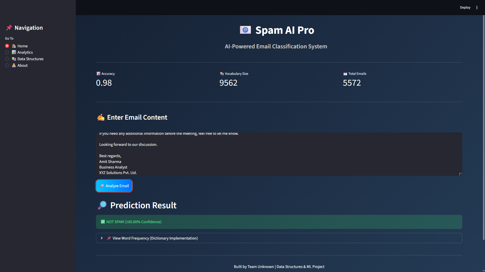

# 📧 Spam Email Classifier Pro

A modern **Spam vs Not Spam Email Classification System** built using **Data Structures and Machine Learning**, deployed with a professional **Streamlit Web Interface**.

---

## 🚀 Project Overview

Spam emails are increasing rapidly and pose serious security risks such as phishing, fraud, and malware attacks.  
This project builds an intelligent spam detection system using:

- Core **Data Structures**
- **Multinomial Naive Bayes Algorithm**
- Real-time classification
- Interactive analytics dashboard

The system classifies emails as:

- ✅ Not Spam (Ham)
- 🚨 Spam

---

## 🖥️ Project Screenshot



---

## 🎯 Features

- 🔎 Real-time Email Classification  
- 📊 Analytics Dashboard  
- 📈 Spam vs Ham Distribution (Donut Chart)  
- 🔥 Top 10 Frequent Words Visualization  
- 📉 Confusion Matrix  
- 📚 Data Structures Explanation Section  
- 🎨 Modern Glassmorphism UI  

---

## 🧠 Data Structures Used

| Data Structure | Purpose |
|---------------|----------|
| **List** | Tokenization of text |
| **Set** | Unique vocabulary creation |
| **Dictionary (HashMap)** | Word frequency mapping |
| **Counter** | Top frequent word extraction |
| **Sparse Matrix** | Efficient feature storage using CountVectorizer |

---

## 🛠️ Technologies Used

- Python  
- Streamlit  
- Scikit-learn  
- Pandas  
- Matplotlib  
- NumPy  
- Virtual Environment (venv)  

---

## 📂 Project Structure
email-spam-classifier/
│
├── app.py
├── spam.csv
├── requirements.txt
├── README.md
│
└── assets/
└── ui.png


---

## ⚙️ Installation & Setup

### 1️⃣ Clone Repository

```bash
git clone https://github.com/yourusername/email-spam-classifier.git
cd email-spam-classifier
2️⃣ Create Virtual Environment
python -m venv venv

Activate the environment:

Windows:

venv\Scripts\activate

Mac/Linux:

source venv/bin/activate
3️⃣ Install Dependencies
pip install -r requirements.txt
4️⃣ Run the Application
streamlit run app.py
📊 Model Details

Algorithm: Multinomial Naive Bayes

Dataset: SMS Spam Dataset

Train-Test Split: 80% Training / 20% Testing

Feature Extraction: CountVectorizer

Evaluation Metrics: Accuracy Score + Confusion Matrix

📈 System Architecture
User Input
    ↓
Text Preprocessing
    ↓
Feature Extraction (CountVectorizer)
    ↓
Multinomial Naive Bayes Model
    ↓
Prediction + Confidence Score
    ↓
Analytics Dashboard
🔮 Future Improvements

Deploy on Cloud (AWS / Streamlit Cloud / Render)

Implement Deep Learning (LSTM / BERT)

Add Explainable AI

Integrate Live Email API

Improve UI animations and interactivity

👨‍💻 Author

Gaurav Kumar
B.Tech Computer Science
Data Structures & Machine Learning Project

⭐ Support

If you found this project helpful, consider giving it a ⭐ on GitHub!


---

If you want, I can now:

- Make a **professional GitHub bio description**
- Write a **LinkedIn post to showcase this project**
- Create a **portfolio-ready short project summary**
- Optimize this README for recruiter visibility**

Tell me what you want next 🚀
